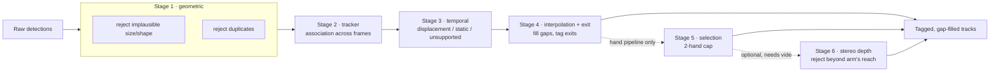

# Detection Quality Adapter

**`adapter`** — a post-processing stage between a hand detector and downstream consumers.

   

Corrects false positives/negatives using temporal (multi-frame) logic,
without touching or retraining the detector.

See `../../planning.md` for the milestone plan and `../../hand_detection_spec.pdf`
for the source spec. Dataset lives in `../../data/` (see its README for schema).

## Contents

- [Setup](#setup)
- [Pipeline at a glance](#pipeline-at-a-glance)
- [Visualizing stage 1 (geometric rejection)](#visualizing-stage-1-geometric-rejection)
- [Visualizing stage 2 (the tracker)](#visualizing-stage-2-the-tracker)
- [Visualizing stage 3 (temporal rejection)](#visualizing-stage-3-temporal-rejection)
- [Visualizing stage 4 (interpolation + exit) and the full pipeline](#visualizing-stage-4-interpolation--exit-and-the-full-pipeline)
- [Milestone 6: the hand-specialized pipeline](#milestone-6-the-hand-specialized-pipeline)
- [Visualizing the hand-specialized pipeline](#visualizing-the-hand-specialized-pipeline)
- [Milestone 7: calibration, honestly](#milestone-7-calibration-honestly)
- [Running the final pipeline on the whole dataset](#running-the-final-pipeline-on-the-whole-dataset)

## Pipeline at a glance

Six stages, each documented and visualized below. Stages 1–4 are generic; 5–6 are hand-specialized (`run_hand_pipeline`) and opt-in.



## Setup

```
conda activate yourenv
pip install -r requirements.txt
pytest
```

## Visualizing stage 1 (geometric rejection)

`tests/test_geometric.py` covers stage 1 on synthetic fixtures;
`tests/test_geometric_real_data.py` checks it against real clips. To see it
by eye, render an annotated video for a real clip bundle:

```
python scripts/visualize_stage1.py ../../data/0c54a47b_t010 /tmp/stage1_t010.mp4
```

Color legend: green = kept untouched, blue = kept after absorbing a
duplicate, orange dashed = dropped as a duplicate, red dashed = dropped for
implausible size/shape. Add `--max-frames N` for a quick preview.

## Visualizing stage 2 (the tracker)

`tests/test_association.py` covers the tracker on synthetic sequences;
`tests/test_association_real_data.py` checks it against real clips (run
through stage 1 first, matching the real pipeline order). To see it by eye,
render an annotated video for a real clip bundle:

```
python scripts/visualize_tracks.py ../../data/0c54a47b_t010 /tmp/tracks_t010.mp4
```

Each track gets its own persistent color (stable across the whole clip) plus
a short fading trail of recent centers, so identity continuity across a gap,
or an identity swap on a crossing, is visible directly. The console output
also prints every track's id/first-frame/last-frame/detection-count, useful
for spotting excessive fragmentation. Add `--max-frames N` to cap the
rendered video length (the tracker itself always runs on the full clip,
since this is an offline per-clip problem).

## Visualizing stage 3 (temporal rejection)

`tests/test_temporal.py` covers displacement/unsupported/static rejection on
synthetic tracks; `tests/test_temporal_real_data.py` checks it against real
clips using the clip's own VIO pose as the camera-motion signal. To see it
by eye, render an annotated video for a real clip bundle:

```
python scripts/visualize_temporal.py ../../data/0c54a47b_t010 /tmp/temporal_t010.mp4
```

Color legend: green = kept, red dashed = rejected for implausible
displacement, purple dashed = rejected as an unsupported/flicker track,
yellow dashed = rejected as static background. Add `--max-frames N` for a
quick preview.

<details>
<summary><strong>The static rule needed a sustained-run requirement, not just a threshold</strong></summary>

The first version of `reject_static` flagged any single frame where a box
moved less than `static_px_threshold` while the camera was "moving" (a very
low bar: 0.05 m/s or 1°/frame, true almost continuously for a head-mounted
camera on someone working). Eyeballing real clips (`t010`, `407258cd_t036`)
showed this over-firing badly: on `t010` it rejected 261/5120 survivors
(5.1%), and inspection showed real hands getting flagged just for pausing
for a frame or two (e.g. frame 16 — a hand actively holding a device).

The deeper issue: a head-mounted camera's apparent motion is often
rotation-dominated (the wearer turning their head), and whatever the wearer
is looking at — for hand-eye tasks, usually their own hands — sits near the
center of gaze and shows the *least* apparent motion of anything in frame.
So a naive per-frame displacement threshold is almost backwards: it's most
likely to flag the hand of interest and least likely to catch peripheral
background clutter.

Fix applied: `reject_static` now requires `min_static_run_frames` (default
15) *consecutive* still-while-moving frames before rejecting anything, and
rejects the whole confirmed run including its first frame, not just the
tail. This is a real logic change, not a threshold tweak — a brief real
pause is, by construction, too short to trip it. Effect on `t010`: static
rejections dropped from 261 to ~0 (stage 3's total rejection rate dropped
from 5.7% to 0.6%, now almost entirely the flicker rule).

**This does not fully solve the problem.** On `407258cd_t036` (a
woodcarving clip), stage 3 still rejects 9.2% of survivors, nearly all
static — frame 220 shows the left hand bracing a workpiece while the right
hand carves, correctly identified as a real, deliberately-still hand, but
flagged anyway because it stays still for *seconds*, not frames. No
sustained-run window is long enough to admit a genuine multi-second brace
while still catching real background. Solving this properly means
distinguishing rotation-induced apparent motion from translation-induced
parallax and judging staticness against the *expected* motion at a box's
position, rather than a flat pixel threshold — deferred to Milestone 7,
where labeled data can validate that approach instead of more eyeballing.

</details>

<details>
<summary><strong>Speed/gate calibration: the tracker gate and the displacement check needed to split</strong></summary>

Both the tracker's match gate (stage 2) and the displacement-plausibility
rule (stage 3) originally shared one `Config.max_speed_px_per_frame` value
(150 px/frame). Checking real per-clip speed distributions across all 39
clips (using the tracker's own matched consecutive-detection pairs) surfaced
two things:

1. **Across 38 of the 39 clips, adjacent-frame hand speed is tightly and
   consistently distributed**: p99 = 82.6 px/frame, p99.5 = 97.7,
   p99.9 = 132.0. The old 150 default sat essentially at p99.9 — so loose
   that stage 3's displacement rule almost never fired (0 rejections on
   `t010`, ~1-2 on other clips), even though inspection found real
   "wobble" moments (motion blur / confidence dips mid-fast-motion — the
   spec's own edge-case table calls this out) that the rule should have
   caught. Several of these wobble segments sit inside tracks hundreds to
   over a thousand detections long, confirming the *tracker* had the right
   identity the whole time — it was specifically the plausibility check
   that was too loose to flag the bad frame.
2. **One clip, `ae580129_t057` (a maintenance worker's "open_cover" task),
   is a different population, not an outlier to fit**: its VIO camera speed
   averages 0.375 m/s vs. 0.155 (`t010`) and 0.082 (`t036`) — 2-4x higher —
   and its hand-speed distribution is shifted the same way (median
   28.5 px/frame vs. ~9 elsewhere; p99 = 202.9 vs. 82.6). This isn't
   noisier tracking, it's a faster-moving task inflating apparent
   image-space speed via camera ego-motion. A single flat px/frame
   threshold can't tell "fast hand" from "normal hand, fast camera" apart —
   see the open question in `planning.md` about scaling this threshold by
   the clip's own VIO speed instead.

**Fix applied now** (informal calibration from unsupervised distributional
data, same pattern as the static-rule fix — no labels needed for this part):
split the one shared value into two.
`Config.max_speed_px_per_frame` (now 110, just above the 38-clip p99.5) is
used only by stage 3's plausibility check. `Config.track_gate_speed_px_per_frame`
(350, comfortably above the single fastest jump ever observed in any clip,
305.8 px/frame) is used only by the stage-2 tracker's match gate, and is
deliberately generous — its only job is to not sever a genuine track at the
exact moment it's moving fastest; flagging that moment as untrustworthy is
stage 3's job, not stage 2's. Effect on `t010`: track count dropped from 65
to 44 (the old shared, tighter gate was fragmenting real tracks), while
stage 3's rejection rate rose modestly from 0.6% to 1.5% (catching more real
wobble moments without breaking track continuity to do it).

**Deferred to Milestone 7**: making `max_speed_px_per_frame` adaptive to the
clip's own camera speed at each frame (via `ClipData.pose`, the same signal
already driving the static rule), so `ae580129_t057`-like clips don't need a
systematically higher false-rejection rate than calmer clips. This needs
labeled data to validate the scaling factor rather than more eyeballing.

</details>

## Visualizing stage 4 (interpolation + exit) and the full pipeline

`tests/test_interpolation.py` covers gap-fill/exit on synthetic tracks
(including the design notes below); `tests/test_interpolation_real_data.py`
checks it against real clips; `tests/test_pipeline_synthetic.py` is the
Milestone 5 exit-criteria integration test (`pipeline.run_pipeline` end to
end on one synthetic multi-object clip). To see stage 4 by eye on a real
clip, using the real, now fully-wired pipeline:

```
# batch by default: 5 random clips -> scripts/output/interpolation/
python scripts/visualize_interpolation.py

# pick how many random clips, and cap frames for a quick look
python scripts/visualize_interpolation.py --num-clips 10 --max-frames 300

# specific clips, or a reproducible random sample
python scripts/visualize_interpolation.py --clips 0c54a47b_t010 407258cd_t036
python scripts/visualize_interpolation.py --seed 42
```

Color legend: green = kept, cyan = interpolated (a gap stage 4 filled back
in), red dashed = rejected (any stage 1/3 reason). A track confirmed as
leaving the frame gets an "EXIT" label drawn at its last real frame. Each
clip gets its own `{clip_id}_interp.mp4` under `--output-dir` (default
`scripts/output/interpolation/`) plus a per-clip stats printout and a run
summary; one clip failing doesn't stop the batch.

`pipeline.py` is wired for real as of this milestone: `run_pipeline(clip.
detections, clip.pose)` runs all four stages in order and returns tagged,
gap-filled tracks — matching `ClipData`'s shape directly, so it can be
called straight off `ingest.load_clip`'s output.

<details>
<summary><strong>A real bug found by real-data testing: exit detection used box center, not edge</strong></summary>

The exit test's first version measured distance from a box's *center* to
the nearest frame border. On synthetic fixtures (small, fixed-size boxes)
this is indistinguishable from edge distance, so it passed every synthetic
test — but on real clips it made **zero** tracks classify as `exiting`
across all three clips checked, despite hands obviously leaving frame in
every one of them (e.g. hairstyling, hands going below the chair). This
dataset's boxes are often large/near-frame-filling: a real `t010` box with
`y2=1200` — sitting exactly on the 1200px-tall frame's bottom edge — had a
center only ~1093, **107px short** of the default 20px margin. Fixed by
measuring from the box's own nearest edge instead of its center. After the
fix: 8/6/10 tracks correctly classified as `exiting` on `t010`/`t036`/
`ae580129_t057`. A regression test (`test_stage4_actually_classifies_some_
real_exits`) locks this in, deliberately excluding `6cd0b236_t000` — a dense
clip with only 2 tracks, both running to the clip's own last frame with no
dropouts at all, so genuinely nothing to exit from there.

</details>

<details>
<summary><strong>Design notes carried over from the spec cross-check</strong></summary>

Two things flagged in `planning.md` before this milestone was built, both
implemented:

- **`rejected` detections count as gap material.** A track's detections
  tagged `rejected` by stage 3 (e.g. a motion-blur displacement flag) are
  excluded from the "trustworthy anchor" sequence stage 4 reasons about —
  their position isn't trusted, but the frame they're on is still eligible
  to be filled in, exactly like a frame with no detection at all. Filling
  overwrites the rejected box rather than leaving a stray untrustworthy one
  next to a new one. This is what keeps the Milestone 4 speed-threshold
  tightening from being a net loss: a wobble frame gets flagged untrustworthy
  *and then* recovered, matching the spec's "motion blur ... interpolate
  where the trajectory remains continuous" edge case instead of just losing
  the frame.
- **Per-border exit configurability.** `Config.exit_border_margin_overrides`
  and `exit_requires_outward_motion` let a border have its own margin and
  drop the outward-motion requirement — generic defaults require outward
  motion everywhere with one shared margin, matching spec Part 1. Milestone
  6 will set a larger, motion-optional bottom-border override for hands
  (torso occlusion doesn't look like walking out of frame), without needing
  any changes to `interpolation.py` itself.

</details>

<details>
<summary><strong>A real bug found while writing the tests, not the code</strong></summary>

While hand-deriving the expected numbers for the "gap resumes far from
prediction" test, the original gap-fill check turned out to be tautological:
it computed the "predicted" position using the *same two points* (the gap's
own before/after anchors) it was then checking that prediction against —
so the distance was always zero and every gap would have passed the check
regardless of how implausible the resumption was. Fixed by predicting from
the anchor's own *incoming* velocity (from whatever came before it in the
track), independent of where the gap actually resumes. Caught before it
ever ran against real data, by tracing through the synthetic test math by
hand rather than trusting the first green test run.

</details>

## Milestone 6: the hand-specialized pipeline

`pipeline.run_hand_pipeline(clip.detections, clip.pose)` runs stages 1-4
exactly as the generic pipeline, using `hand_config()` (tuned defaults, see
below) instead of `Config()`, plus two more stages: 5 (`selection.py`,
enforcing the 2-hand cap by track quality) and, if video paths are passed,
6 (`stereo_depth.py`, rejecting detections beyond arm's reach).

```python
from adapter.ingest import load_clip
from adapter.pipeline import run_hand_pipeline

clip = load_clip("../../data/0c54a47b_t010")
tracks = run_hand_pipeline(
    clip.detections, clip.pose,
    video_left_path="../../data/0c54a47b_t010/video_left.mp4",
    video_right_path="../../data/0c54a47b_t010/video_right.mp4",
)  # video paths optional -- omit them to skip stage 6
```

**`hand_config()`** (`adapter/hand_config.py`) overrides, each backed by a
real-data check rather than guessed, same as every other threshold in this
project:

- `class_max_instances=2`, `candidate_pool_size=4` — per spec.
- `plausible_shape=(0.5, 2.0)` — real hand aspect ratios across all 39
  clips' stage-1 survivors: p1=0.54, median=0.92, p99=2.10.
- `duplicate_containment_threshold=0.7` — see below.
- `exit_border_margin_overrides={"bottom": 150.0}`,
  `exit_requires_outward_motion={"bottom": False}` — see Milestone 5's notes
  above; the numbers come from checking how far real ambiguous-dropout
  tracks' last box sits from the bottom edge across `t010`/`t036`/
  `ae580129_t057`.
- `max_reach_m=1.8` — carried over from the `exp/scafholds/` prototype's own
  validation (see `stereo_depth.py`'s docstring): a hairstyling task's
  own-hand detections regularly exceed 1m with arms extended toward a
  seated client, so a tighter, more "arm's-length"-sounding threshold would
  reject the wearer's own hands during completely normal reaching.

<details>
<summary><strong>Hands crossing/overlapping vs. true duplicates: the containment-ratio fix</strong></summary>

The spec's edge case table is explicit: two hands crossing must be retained
as two detections, never merged as a duplicate. But Milestone 2's
`reject_duplicates` runs pre-tracking, on IoU alone, with no way to tell "one
object detected twice" from "two real objects that happen to overlap."
Checked real data for a discriminator: scanning all 39 clips' moderate-IoU
2-detection frames, every one that looked like a genuine duplicate echo had
a *containment ratio* (intersection / smaller-box-area) of at least 0.73 —
they're nested, one strong box mostly inside a weaker one — while a
synthetic same-size 50%-overlap crossing (representative of two similarly-
sized real hands) sits at 0.5. `hand_config()` sets
`duplicate_containment_threshold=0.7`, comfortably between the two, gated
behind a new `Config` field that defaults to 0.0 (always passes, no behavior
change) so the generic pipeline and all of Milestone 2's existing tests are
untouched. `tests/test_hand_config.py` includes a test pair proving the
fix's precision: a crossing-hands pair right in the gap between the two
gates (IoU 0.52, containment 0.68) survives under `hand_config()` but
would have merged under the generic `Config()` — and a true duplicate
(containment 0.95) still correctly merges either way.

</details>

<details>
<summary><strong>Stereo depth: migrated from `exp/scafholds/`, not a new build</strong></summary>

The "beyond arm's reach" rule (`stereo_depth.py`) was already built and
validated against real `t010` data in an earlier exploratory session, but
lived in `exp/scafholds/` as a standalone prototype using ad-hoc dicts, with
one test hardcoded to an old sandbox upload path (`/mnt/user-data/uploads`)
that doesn't exist in this repo. Migrated into the real package: adapted to
`Detection`/`Config`/`Tag` instead of dicts, the broken test path fixed to
point at `data/`, and a new `apply_stereo_depth_stage` added to run it
across a whole clip's tracks (grouped by frame, so each frame's video pair
is decoded once regardless of how many detections land on it). The old
`exp/scafholds/` files were deleted once the migration was verified —
nothing outside that directory imported from them. See
`nominal_calibration.py`'s module docstring for the full calibration
derivation (nominal ZED X, 2.2mm lens, 12cm baseline — not exact, good
enough for a coarse arm's-reach threshold, not precision depth).

Only runs when both video paths are given to `run_hand_pipeline` (or
`config.max_reach_m` is set at all) — it needs actual pixel data, which nothing
else in this pipeline touches, so it's opt-in rather than baked into the
default 5-stage flow.

**⚠️ Not validated across the dataset — see the Milestone 7 section below.**
The calibration above was derived from and checked against exactly one clip
(`t010`). Running it against all 39 clips found a confident false rejection
of the wearer's own hands on a different clip, and `meta.json` confirms the
dataset spans multiple recording batches that likely used different
physical camera rigs. Treat this stage as experimental outside `t010`
specifically until that's resolved — it's why the final full-dataset run
further down doesn't include it.

</details>

<details>
<summary><strong>Gloved/partially-occluded hands: deliberately not implemented</strong></summary>

Per the spec's own instruction ("behaviour unmeasured, needs labelled
examples — don't guess at logic here"), this edge case has a dedicated
`xfail(strict=True)` test in `test_hand_config.py` instead of a guessed
implementation. It should keep failing until Milestone 7 provides real
examples to design against; `strict=True` means it'll loudly break the
suite (an "XPASS" failure) if something accidentally makes it pass first,
which would mean untested behavior slipped in silently.

</details>

## Visualizing the hand-specialized pipeline

`tests/test_hand_config.py` covers one synthetic case per row of the spec's
edge-case table (S6); `tests/test_selection.py` covers stage 5;
`tests/test_stereo_depth.py`/`test_nominal_calibration.py` cover stage 6 on
synthetic stereo pairs; `test_stereo_depth_real_data.py` checks it against
real video. To see the whole hand pipeline by eye, batch by default like
`visualize_interpolation.py`:

```
# 5 random clips (default) -> scripts/output/hand_pipeline/
python scripts/visualize_hand_pipeline.py

# more clips, capped frames
python scripts/visualize_hand_pipeline.py --num-clips 10 --max-frames 300

# specific clips, reproducible sample
python scripts/visualize_hand_pipeline.py --clips 0c54a47b_t010 407258cd_t036
python scripts/visualize_hand_pipeline.py --seed 42

# also run stage 6 (stereo depth) -- slower, needs per-detection video seeks
python scripts/visualize_hand_pipeline.py --clips 0c54a47b_t010 --max-frames 300 --stereo-depth
```

Color legend (finer-grained than `visualize_interpolation.py`'s flat
"rejected", specifically so Milestone 6's two *new* rejection reasons are
checkable by eye): green = kept, cyan = interpolated, red = rejected at
stage 1 (geometric), orange = stage 3 (temporal), purple = stage 5
(selection — outranked for the 2-hand cap), yellow = stage 6 (stereo depth
— beyond arm's reach). This needed extending the same before/after
tag-diffing approach `visualize_temporal.py` uses (diagnostic-only, kept out
of the core modules), across all five/six stages instead of just three.

**Note:** unlike `visualize_interpolation.py`, `--max-frames` here caps what's
actually fed into the pipeline, not just the rendered video length. Stage 6
does a real video seek + template match per surviving detection — running it
over a full ~2700-frame clip for what was meant to be a quick preview took
over 15 minutes before this was fixed; capping the input, not just the
render, brought a 150-frame `--stereo-depth` preview down to ~20s.

Checked visually on `t010` with `--stereo-depth`: the wearer's own
hand (holding a device close to the camera) stays green ("kept"), while a
detection out near the seated client — clearly beyond arm's reach — gets
flagged yellow ("rejected_stereo_depth"), confirming the depth check is
discriminating on the right thing rather than misfiring on the wearer's
own hands.

## Milestone 7: calibration, honestly

**There is no labelled reference set for this dataset.** Spec S7: "No value
here should be set by inspection. A labelled reference set is required."
`hand_boxes.json` is the raw, noisy input this whole adapter corrects, not
ground truth — there's no file anywhere in `data/` recording which boxes are
actually right. So the precision/recall-optimal half of Milestone 7 is
genuinely blocked, not skipped. `calibration/metrics.py` builds that
machinery anyway (per-stage `StageMetrics`, greedy IoU matching against
ground truth, `flag_wrong_direction_stages`) and verifies it against
hand-built synthetic ground truth — ready to run the moment real labels
exist, but **no number it could report about this project's real clips
today would be a real precision/recall figure**, and the module's docstring
says so before anyone can misquote it.

What spec S7-S8 explicitly allow (and `calibration/sweep_thresholds.py`
implements) without labels, run for real across all 39 clips:

```
python calibration/sweep_thresholds.py
```

- **Rejection-reason frequency** (a real proxy for spec S7's "frequency of
  each false-positive class," not a confirmed false-positive rate — that
  still needs labels): of 156,840 total detections (153,876 raw + 2,964
  stage-4 fabrications), 85.3% kept, 5.1% temporal, 3.1% dropped as
  duplicates, 2.6% size/shape, 2.5% interpolated, 1.3% selection.
- **Dropout-length distribution** — spec S7 names this one directly as
  needing no labels ("sets the largest break that may safely be
  interpolated"). Directly retuned `max_dropout_frames`.
- **Interpolated-detection proportion** — spec S8's standing check, which it
  explicitly says needs no labelled data: mean 3.5%, max 17.2%
  (`beb348be_t000` — checked by hand, longest interpolated runs there are
  6-12 frames, consistent with genuine brief-occlusion recovery, not
  fabrication creeping in).
- **Not attempted**: candidate-pool-width tuning ("rate at which a true
  hand is outranked by a spurious box"). No way to know which candidate was
  "true" without labels.

<details>
<summary><strong>Two accounting bugs found building the calibration tool itself</strong></summary>

`rejection_reason_frequency`'s first version only walked `tracks`, which
silently dropped every stage-1 casualty from the count: `reject_duplicates`
drops a duplicate's loser without tagging it (only the winner gets `merged`),
and `reject_implausible_size`/`_shape` do the same after tagging `rejected`
— either way, the detection never reaches `track_detections` and so never
appears in any `Track`. Undercounted the real dataset by 4.1% (147,590 vs.
153,876) with no error raised. The fix — walk the original per-frame lists
to catch stage-1 casualties — then silently dropped stage 4's brand-new
*fabricated* `interpolated` detections in the other direction, since those
never existed as raw input either. An independent total-count assertion in
`tests/test_sweep_thresholds.py` (built by re-running the pipeline by hand,
not by calling the function under test) caught this before either version
shipped. Worth remembering: a total that "adds up" isn't proof of
correctness on its own — the first buggy version's total looked internally
consistent too, right up until it was checked against an independently
computed number.

</details>

<details>
<summary><strong>Parameters retuned from this data</strong></summary>

Both in `hand_config()`, both still informal/distribution-based (not
precision/recall-optimal, since that needs labels):

- **`plausible_size`**: (20, 800) → **(50, 1150)**. Real side-length
  percentiles across all 153,876 raw detections: p1=94px, p99=586px,
  max=1110px. The old lower bound was a complete no-op — 0% of real
  detections come anywhere near 20px — and the old upper bound incorrectly
  rejected ~0.16% (253) of raw detections that are far more likely genuine
  close-up hands than noise, given this dataset's own near-frame-filling
  characteristic (see the stereo-depth section above) and no evidence
  they're spurious.
- **`max_dropout_frames`**: 10 → **15**. Real internal-gap lengths within
  tracks (measured with the cap loosened to 10,000 so the current threshold
  didn't pre-clip the measurement): p50=3, p75=13, p90=54, p99=470, worst
  case 2529 frames. The old value of 10 sat just under p75 — over a quarter
  of genuine short recoverable gaps were already too long to interpolate.
  The tail beyond p90 isn't trustworthy as "the same object": by then the
  position gate (`track_gate_speed_px_per_frame * dt`) has grown so wide it
  no longer meaningfully constrains anything, so those almost certainly
  reflect coincidental position matches between different objects, not real
  dropouts. 15 covers the reliable p75 mass without reaching into that
  contaminated tail.

</details>

<details>
<summary><strong>Second calibration pass: checking everything else, not just the obvious gaps</strong></summary>

Asked explicitly to calibrate whatever's findable without labels, so every
other threshold got the same real-data check `plausible_size` got. Four came
back genuinely fine — worth recording as verified, not just unexamined:

- `camera_moving_speed_mps` (0.05): real VIO speed p10=0.034, p25=0.054 m/s
  — sits right in that transition zone.
- `camera_moving_angular_deg_per_frame` (1.0): real angular-delta p75=0.77,
  p90=1.4 deg/frame — reasonable middle zone. Deliberately not loosened
  despite the median (0.38) being lower: loosening it would make "camera
  moving" easier to satisfy, working against Milestone 4's sustained-run fix.
- `static_px_threshold` (4.0): real adjacent-frame displacement within long,
  clearly-genuine tracks has p25=3.68px — almost exactly the same relative
  position as the speed threshold above.
- `duplicate_iou_threshold` (0.5): the real same-frame box-pair IoU
  distribution is strongly bimodal — 82.4% of pairs sit below IoU 0.05
  (clearly distinct objects), then a real separate cluster from 0.5-0.7
  (6.4% of all pairs). 0.5 sits right at the start of that cluster, not
  arbitrarily splitting a smooth distribution.
- The generic `exit_border_margin_px` (20px, still used by hands for
  side/top borders): real confirmed exits across all 39 clips sit at
  p90 ≤ 3.3px, max 16px, for every side/top border — comfortably inside.

**One real, unresolved limitation found, not a fixable number**:
`max_reach_m` (1.8, derived from `t010` alone) doesn't generalize across
jobs. Every one of the 39 clips is a *different* job (`meta.json`'s `job`
field — Hair stylist, Carpenter, Farmworker, Jeweler, Mason, ... no two the
same). Running stereo depth across 4 more clips found real median own-hand
depth varies sharply: Farmworker 0.77m vs. Hair stylist/Carpenter/Barber
1.5-1.8m. A single global threshold can't be optimal for both — tight
enough to matter for close-work jobs would falsely reject genuine
far-reaching own-hands on extended-reach ones. Kept at 1.8 deliberately:
under-firing on close-work jobs is the safer failure mode than over-firing
on reach-heavy ones, consistent with this rule's existing conservative bias
(a false reject discards a real hand permanently; a missed reject just
leaves a candidate for later review). A job-aware version is a well-motivated
future improvement but risks being circular without labels to validate it —
deriving a job's expected reach from its own detections' observed depth is
contaminated by exactly the bystander population the rule exists to exclude.

</details>

## Running the final pipeline on the whole dataset

```
python scripts/visualize_hand_pipeline.py --all --output-dir scripts/output/final_all_clips
```

Runs the tuned hand-specialized pipeline (stages 1-5; stage 6/stereo depth
omitted by default — see the note above about `--stereo-depth`'s cost, which
would run to several hours across the full dataset rather than the ~15-20
minutes stages 1-5 take) across every clip and writes one annotated
`{clip_id}_hand.mp4` per clip.

Run against all 39 clips: 996.8s (~16.6 min), 148,714 final detections
across 787 tracks. 90.5% kept, 5.5% rejected at stage 3 (temporal), 2.6%
interpolated, 1.4% rejected at stage 5 (selection), 36.1% of tracks
confirmed exiting — matches `sweep_thresholds.py`'s numbers exactly, a good
cross-check between the two tools.

**One honest limitation, found while reviewing this run**: `rejected_geometric`
reads 0 across every single clip in this script's stats and is never drawn
in the videos. Not a pipeline bug — it's the same root cause documented in
`sweep_thresholds.py`'s docstring: a detection dropped at stage 1 (a
duplicate's loser, or a size/shape reject) never reaches `track_detections`,
so it never appears in any `Track`, and this script only walks `tracks` for
both its stats and its rendering. The pipeline's actual output is unaffected
(those detections are correctly absent from the final result either way) —
this only means this particular video can't show *why* a stage-1 rejection
happened. `scripts/visualize_stage1.py` already covers that view correctly
frame-by-frame.

**A second run, with stereo depth, was tried and reverted.** At the user's
request, an overnight run (`--all --stereo-depth`, no frame cap) completed
successfully — 14,319.9s (~4 hours), all 39 clips, no crashes. Stages 1-5's
numbers matched the run above exactly, as expected. But reviewing stage 6's
results before presenting them surfaced the calibration problem documented
above: a confident false rejection of the wearer's own hands on
`42bba884_t012` (computed at 2.67-2.75m, match confidence 0.88-0.93 — not a
low-confidence case the existing safety net would catch), traced to the
nominal calibration only ever having been validated against `t010`, plus
confirmation from `meta.json` that the dataset spans multiple recording
batches (`"library": "v3"` vs `"legacy_v1"`) likely using different physical
camera rigs. Given the choice between keeping that run with heavy caveats,
sinking more time into an unvalidated fix, or reverting to the stages-1-5
result as the reliable deliverable, **the user chose to revert** — the
numbers above are that reverted, regenerated final run. The stereo-depth
run's log (`final_all_clips_stereo_log.txt`, sitting alongside
`final_all_clips/` in the same output directory) is kept for reference
rather than deleted, since it's the evidence behind the calibration finding,
not because its numbers should be trusted.

