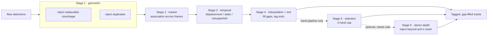

# Detection Quality Adapter

A post-processing layer that sits between a hand detector and downstream
consumers. It corrects false positives and false negatives in a stream of
per-frame bounding boxes using multi-frame temporal logic — without
retraining or otherwise touching the detector itself.

The source spec is in [`hand_detection_spec.pdf`](hand_detection_spec.pdf).

## Why post-processing, not a better detector

A single frame can't tell a duplicate box from a real one, or a bystander's
hand from the wearer's — both mistakes only become visible when you look
across many frames and ask whether a box belongs to a continuous, physically
plausible trajectory. So the detector is left to over-report (every
plausible box, no cap, no dedup), and a stateful pipeline runs after it with
the context a single frame never has.

## Pipeline

Six stages, always in this order — each one depends on the previous stage's
output:



| Stage | What it does |
|---|---|
| 1. Geometric | Merges duplicate boxes, drops implausible size/shape — per-frame only |
| 2. Association | Greedy nearest-neighbor tracker; links boxes into tracks using position and velocity, never the detector's left/right label |
| 3. Temporal | Drops impossible jumps, single-frame flickers, and static background (relative to camera motion, from VIO pose) |
| 4. Interpolation | Fills short real gaps by prediction; a border-exit test runs first and vetoes any fill where the object plausibly left frame |
| 5. Selection | Hand-specific. Enforces a 2-instance-per-frame cap by track quality, not per-frame confidence |
| 6. Stereo depth | Hand-specific, opt-in. Rejects a box whose estimated depth puts it beyond arm's reach — needs both eyes' video |

Stages 1–4 are generic (`pipeline.run_pipeline`) and know nothing about
hands specifically. `hand_config()` layers hand-specific thresholds on top
and `pipeline.run_hand_pipeline` adds stages 5–6.

Every detection carries a `tag`: `reported`, `merged`, `rejected`, or
`interpolated`. Nothing is ever deleted — a rejected box stays in the
record, tagged untrustworthy, so every stage's decision stays auditable.

**Stage 6 (stereo depth) is experimental outside the one clip its
calibration was validated against** — see `adapter/stereo_depth.py`'s module
docstring for the full finding. It's opt-in and off by default.

## Project structure

```
adapter/       core pipeline stages (geometric, association, temporal, interpolation, selection, stereo depth)
calibration/   ground-truth-free calibration tooling (metrics scaffolding, threshold sweeps over real data)
tests/         synthetic + real-data tests for every stage
scripts/       batch visualization tools — render annotated video for real clips
data/          clip bundles (video + detections + pose + metadata) — not tracked in git, see data/README.md
```

## Setup

```
pip install -r requirements.txt
pytest
```

Real-data tests and scripts expect a `data/` directory of clip bundles at
the repo root (see `data/README.md` for the schema). Tests that need it are
skipped automatically if it's absent.

## Visualizing a pipeline stage

Each stage has a batch visualization script that renders annotated video for
real clips, color-coding every box by what happened to it and why:

```
python scripts/visualize_stage1.py data/<clip_id> /tmp/out.mp4
python scripts/visualize_tracks.py data/<clip_id> /tmp/out.mp4
python scripts/visualize_temporal.py data/<clip_id> /tmp/out.mp4

# batch, random sample or full dataset, full pipeline with per-box rejection reasons
python scripts/visualize_interpolation.py --num-clips 5
python scripts/visualize_hand_pipeline.py --all
```

Run `--help` on any script for the full option list (frame limits, seeds,
stereo depth opt-in, etc).

## Calibration

`calibration/sweep_thresholds.py` computes real distributional statistics
(box size/shape, dropout-gap lengths, IoU pair distributions, etc.) across
the whole dataset — the basis for every tuned threshold in `hand_config()`.
`calibration/metrics.py` implements precision/recall-style evaluation
against ground truth; this dataset has none, so it's tested against
synthetic ground truth and ready to run the moment a labeled reference set
exists.
